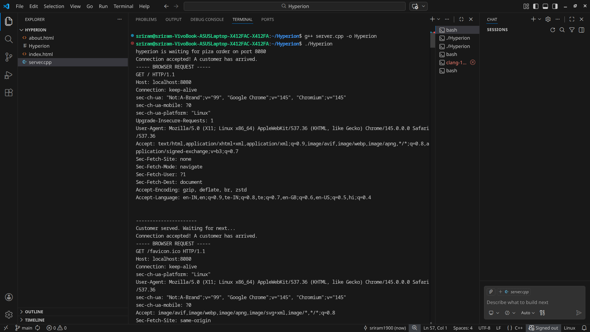
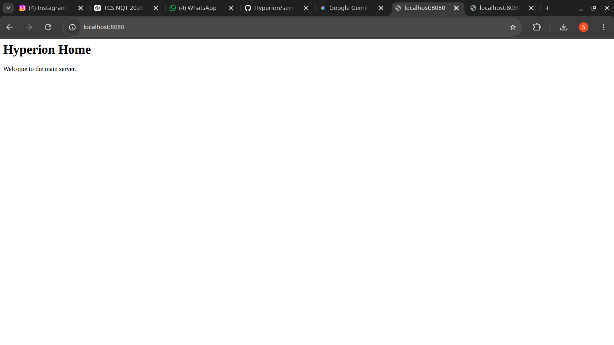

# Hyperion: Multi-threaded Static Web Server (C++)

Hyperion is a high-performance web server built from scratch using C++ and the Linux Socket API. It is designed to handle multiple concurrent client requests by utilizing a multi-threaded architecture.

## 🛠️ Technical Implementation
- **Socket Architecture:** Uses POSIX sockets for low-level TCP/IP communication.
- **Multi-threading:** Implements a detached thread model (`std::thread`). Every connection triggers a new worker thread so the server never blocks.
- **HTTP Parsing:** Captures and parses raw browser headers to identify requested paths like `/` or `/about`.
- **Disk I/O:** Serves physical HTML assets from the local filesystem using `std::ifstream`.
- **Socket Options:** Uses `SO_REUSEADDR` for instant server restarts.

## 📸 Output & Proof of Work

### Real-time Request Handling
The server logs capture the raw HTTP headers and unique **Thread IDs**, proving that the OS is handling requests concurrently:



### Web Interface
The custom engine successfully serves and routes HTML documents:



## 🏗️ Build & Run
1. **Compile with Pthread support:**
   ```bash
   g++ server.cpp -o Hyperion -lpthread
Execute:

Bash
./Hyperion
Access: While the server is running, open your browser and go to: http://localhost:8080

Note: The localhost link only works on the machine where the server is currently running.


---

### 🕵️‍♂️ Summary of why we did this:
1.  **The Link:** We removed the "clickable" link format in the README. Now, it's clear that it is an address to be typed into the browser.
2.  **The Rejected Error:** By running `git pull --rebase`, you combined the work you did on the GitHub website with the work on your laptop. 
3.  **The 404:** Once you run the `git push` in Step 1, your images will finally be on GitHub, and they will appear in your README automatically.

**Try running those 3 Git commands now. Does it finally say "Everything up-to-date"?**
